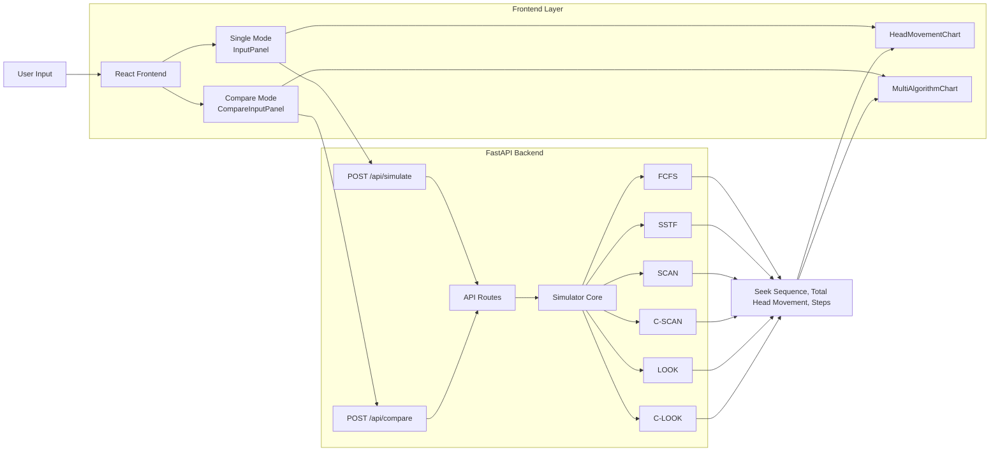

# Disk Scheduling Algorithm Simulator

A cross-platform simulator for various disk scheduling algorithms, featuring a FastAPI backend and a React frontend with animated visualizations.

## Features

- **Six Algorithms**: FCFS, SSTF, SCAN, C-SCAN, LOOK, C-LOOK
- **Single Mode**: Run one algorithm at a time with detailed results
- **Compare Mode**: Select multiple algorithms and compare head movement side-by-side
- **Animated Charts**: SVG-based head movement visualization with configurable animation speed
- **Direction Control**: Choose left/right direction for SCAN, C-SCAN, LOOK, and C-LOOK algorithms
- **Modern UI**: Clean, responsive design with Space Grotesk and Manrope typography

## Tech Stack

- **Backend**: Python 3.11+ with FastAPI
- **Frontend**: React 18
- **Styling**: Vanilla CSS with CSS custom properties
- **Charts**: Custom SVG with CSS animations

## Graphical Abstract



## Project Structure

```
├── backend/
│   ├── app/
│   │   ├── algorithms/    # Algorithm implementations
│   │   ├── api/           # FastAPI routes
│   │   ├── core/          # Simulator logic
│   │   └── schemas/       # Pydantic models
│   └── requirements.txt
└── frontend/
    ├── src/
    │   ├── charts/        # HeadMovementChart, MultiAlgorithmChart
    │   ├── components/    # InputPanel, CompareInputPanel, etc.
    │   ├── pages/         # Simulator page
    │   └── services/      # API client
    └── package.json
```

## Getting Started

### Backend

```bash
cd backend
python -m venv .venv
.venv\Scripts\Activate.ps1  # Windows
pip install -r requirements.txt
uvicorn app.main:app --reload
```

### Frontend

```bash
cd frontend
npm install
npm start
```

The frontend runs on `http://localhost:3000` and the backend API on `http://localhost:8000`.

## API Endpoints

| Endpoint | Method | Description |
|----------|--------|-------------|
| `/api/simulate` | POST | Run a single algorithm simulation |
| `/api/compare` | POST | Compare multiple algorithms |

## Algorithms

| Algorithm | Direction Required | Description |
|-----------|-------------------|-------------|
| FCFS | No | First Come First Serve - processes requests in arrival order |
| SSTF | No | Shortest Seek Time First - selects nearest request |
| SCAN | Yes | Elevator algorithm - moves in one direction, then reverses |
| C-SCAN | Yes | Circular SCAN - returns to start after reaching end |
| LOOK | Yes | Like SCAN but only goes as far as last request |
| C-LOOK | Yes | Circular LOOK - combines LOOK with C-SCAN behavior |


END
